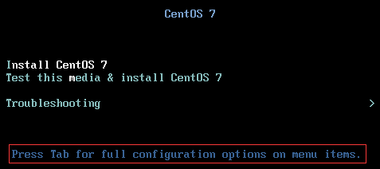
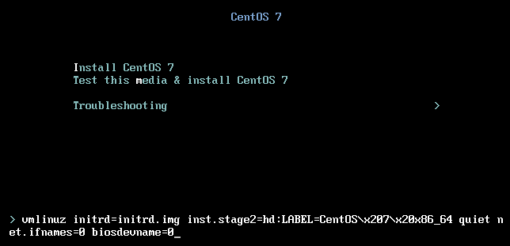

<!-- TOC -->

- [CentOS7](#centos7)
    - [CentOS-7 全新安装，直接修改网卡为eth0](#centos-7-%E5%85%A8%E6%96%B0%E5%AE%89%E8%A3%85%E7%9B%B4%E6%8E%A5%E4%BF%AE%E6%94%B9%E7%BD%91%E5%8D%A1%E4%B8%BAeth0)
    - [CentOS-7修改网卡为eth0(已安装-修改)](#centos-7%E4%BF%AE%E6%94%B9%E7%BD%91%E5%8D%A1%E4%B8%BAeth0%E5%B7%B2%E5%AE%89%E8%A3%85-%E4%BF%AE%E6%94%B9)
        - [编辑网卡信息](#%E7%BC%96%E8%BE%91%E7%BD%91%E5%8D%A1%E4%BF%A1%E6%81%AF)
        - [修改grub](#%E4%BF%AE%E6%94%B9grub)
        - [验证是否修改成功](#%E9%AA%8C%E8%AF%81%E6%98%AF%E5%90%A6%E4%BF%AE%E6%94%B9%E6%88%90%E5%8A%9F)

<!-- /TOC -->

# CentOS7

## CentOS-7 全新安装，直接修改网卡为eth0

    光盘安装的时候，在安装界面做如下操作：
    点击Tab，打开kernel启动选项后，增加net.ifnames=0 biosdevname=0，如下图所示。
    
    

## CentOS-7修改网卡为eth0(已安装-修改)

### 编辑网卡信息

```bash
    [root@centos7 ~]# cd /etc/sysconfig/network-scripts/  #进入网卡目录

    [root@centos7 network-scripts]# mv ifcfg-eno16777728 ifcfg-eth0  #重命名网卡名称

    [root@centos7 network-scripts]# cat ifcfg-eth0  #编辑网卡信息
    TYPE=Ethernet
    BOOTPROTO=static
    DEFROUTE=yes
    PEERDNS=yes
    PEERROUTES=yes
    IPV4_FAILURE_FATAL=no
    NAME=eth0  #name修改为eth0
    ONBOOT=yes
    IPADDR=192.168.56.12
    NETMASK=255.255.255.0
    GATEWAY=192.168.56.2
    DNS1=192.168.56.2
```

### 修改grub

```bash
    [root@centos7 ~]# cat /etc/sysconfig/grub  #编辑内核信息,添加 net.ifnames=0 biosdevname=0 字段的
    GRUB_TIMEOUT=5
    GRUB_DEFAULT=saved
    GRUB_DISABLE_SUBMENU=true
    GRUB_TERMINAL_OUTPUT="console"
    GRUB_CMDLINE_LINUX="crashkernel=auto rhgb **net.ifnames=0 biosdevname=0** quiet"
    GRUB_DISABLE_RECOVERY="true"

    [root@centos7 ~]# **grub2-mkconfig -o /boot/grub2/grub.cfg  #生成启动菜单**
      Generating
    grub configuration file ...
      Found
    linux image: /boot/vmlinuz-3.10.0-229.el7.x86_64
      Found
    initrd image: /boot/initramfs-3.10.0-229.el7.x86_64.img
      Found
    linux image: /boot/vmlinuz-0-rescue-1100f7e6c97d4afaad2e396403ba7f61
      Found
    initrd image: /boot/initramfs-0-rescue-1100f7e6c97d4afaad2e396403ba7f61.img
      Done
```

### 验证是否修改成功

```bash
    [root@centos7 ~]# reboot  #必须重启系统生效
    [root@centos7 ~]# yum install net-tools  #默认centos7不支持ifconfig 需要安装net-tools包
    [root@centos7 ~]# ifconfig eth0  #再次查看网卡信息
    eth0:
    flags=4163<UP,BROADCAST,RUNNING,MULTICAST>  mtu 1500
    inet 192.168.56.12  netmask 255.255.255.0  broadcast 192.168.56.255
    inet6 fe80::20c:29ff:fe5c:7bb1  prefixlen 64
    scopeid 0x20<link>
    ether 00:0c:29:5c:7b:b1  txqueuelen 1000  (Ethernet)
    RX packets 152  bytes 14503 (14.1 KiB)
    RX errors 0  dropped 0
    overruns 0  frame 0
    TX packets 98  bytes 14402 (14.0 KiB)
    TX errors 0  dropped 0 overruns 0  carrier 0
    collisions 0
```


5、接着配置规则，根据Centos 官方WIKI的FAQ中得知，如果你有多个接口，并且想要控制其设备名，而不是让内核以它自己的方式命名

```bash
vim /etc/udev/rules.d/70-persistent-ipoib.rules 
# ACTION=="add", SUBSYSTEM=="net", DRIVERS=="?*", ATTR{type}=="32", ATTR{address}=="?*00:02:c9:03:00:35:73:f2", NAME="eth0"
#修改只需要修改最后面的NAME名称的设备名称和你配置名称一致即可，前面的#号去掉，即可，上面这种方法，同样适用于，所有的克隆的虚拟主机，需要注意，克隆的主机前面的这个MAC地址不能一样需要修改
最后，修改网卡的配置完成了
```